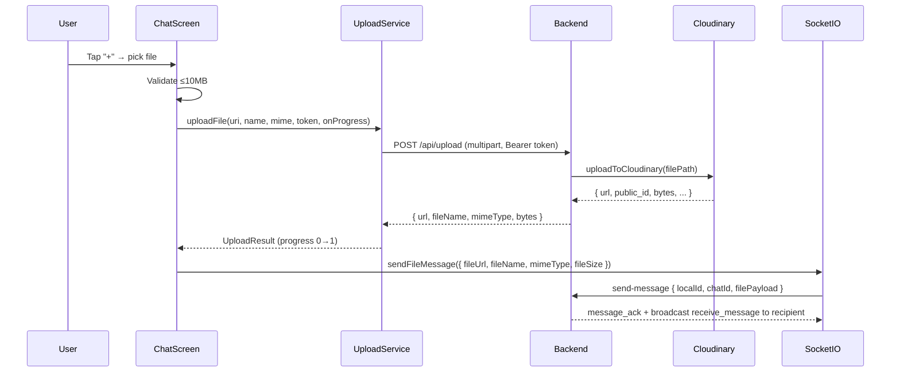

# File Sharing Feature — Walkthrough

## What Was Built

Full file sharing support on top of the existing E2E-encrypted text chat, with zero changes to existing text message flow.

---

## System Architecture



---

## Files Created

### Backend

| File | Purpose |
|------|---------|
| [cloudinary.service.js](file:///D:/React%20Native%20Projects/chat-app/backend/src/services/cloudinary.service.js) | Cloudinary SDK wrapper with `resource_type: auto` |
| [uploadController.js](file:///D:/React%20Native%20Projects/chat-app/backend/src/controllers/uploadController.js) | 10MB validation, Cloudinary upload, temp file cleanup |
| [uploadRoutes.js](file:///D:/React%20Native%20Projects/chat-app/backend/src/routes/uploadRoutes.js) | `POST /api/upload` with Clerk auth + multer LIMIT_FILE_SIZE handler |

### Frontend

| File | Purpose |
|------|---------|
| [lib/uploadService.ts](file:///D:/React%20Native%20Projects/chat-app/mobile-app/lib/uploadService.ts) | XHR upload with [onprogress](file:///D:/React%20Native%20Projects/chat-app/mobile-app/lib/uploadService.ts#41-46) tracking |
| [lib/fileCache.ts](file:///D:/React%20Native%20Projects/chat-app/mobile-app/lib/fileCache.ts) | expo-file-system download + deterministic cache paths |
| [components/FileMessageBubble.tsx](file:///D:/React%20Native%20Projects/chat-app/mobile-app/components/FileMessageBubble.tsx) | Renders image/video/audio/doc based on mimeType |
| [components/UploadProgressBar.tsx](file:///D:/React%20Native%20Projects/chat-app/mobile-app/components/UploadProgressBar.tsx) | Animated progress bar with cancel/retry |

---

## Files Modified

### Backend
- [Message.js](file:///D:/React%20Native%20Projects/chat-app/backend/src/models/Message.js) — Added `type`, `fileUrl`, `fileName`, `mimeType`, `fileSize` fields
- [socket.js](file:///D:/React%20Native%20Projects/chat-app/backend/src/utils/socket.js) — `send-message` now handles both text and file payloads
- [app.js](file:///D:/React%20Native%20Projects/chat-app/backend/src/app.js) — Registered `/api/upload` route

### Frontend
- [types/index.ts](file:///D:/React%20Native%20Projects/chat-app/mobile-app/types/index.ts) — Added file fields to [Message](file:///D:/React%20Native%20Projects/chat-app/mobile-app/types/index.ts#16-38) interface
- [db/database.ts](file:///D:/React%20Native%20Projects/chat-app/mobile-app/db/database.ts) — Migrated to **v3** schema (adds file columns, drops+recreates on first launch)
- [db/messageQueries.ts](file:///D:/React%20Native%20Projects/chat-app/mobile-app/db/messageQueries.ts) — [LocalMessage](file:///D:/React%20Native%20Projects/chat-app/mobile-app/db/messageQueries.ts#5-26) + [insertMessage](file:///D:/React%20Native%20Projects/chat-app/mobile-app/db/messageQueries.ts#27-70) include file columns
- [lib/socket.ts](file:///D:/React%20Native%20Projects/chat-app/mobile-app/lib/socket.ts) — `SOCKET_URL` exported; [sendFileMessage](file:///D:/React%20Native%20Projects/chat-app/mobile-app/lib/socket.ts#282-345) added; `receive_message` handles file messages; pull-sync stores file fields
- [hooks/useMessages.ts](file:///D:/React%20Native%20Projects/chat-app/mobile-app/hooks/useMessages.ts) — Skips decryption for file messages; maps file fields to [Message](file:///D:/React%20Native%20Projects/chat-app/mobile-app/types/index.ts#16-38)
- [components/MessageBubble.tsx](file:///D:/React%20Native%20Projects/chat-app/mobile-app/components/MessageBubble.tsx) — Dispatches to [FileMessageBubble](file:///D:/React%20Native%20Projects/chat-app/mobile-app/components/FileMessageBubble.tsx#23-221) when `message.type === "file"`
- [app/chat/[id].tsx](file:///D:/React%20Native%20Projects/chat-app/mobile-app/app/chat/%5Bid%5D.tsx) — Full file pick → upload → emit flow with progress bar UI
- [app.json](file:///D:/React%20Native%20Projects/chat-app/mobile-app/app.json) — Added `expo-document-picker` plugin

---

## Key Design Decisions

> [!NOTE]
> **File messages bypass E2E encryption** — files are stored on Cloudinary as-is. Only metadata flows through Socket.IO. This is standard practice (WhatsApp, Telegram do the same). Existing encrypted text messages are 100% untouched.

> [!NOTE]
> **expo-file-system/legacy** import is required for SDK 54 because `documentDirectory` moved to the legacy API. This is the correct approach per Expo docs.

> [!IMPORTANT]
> **SQLite v3 migration** drops and recreates the messages table on first launch after update. Existing messages are cleared locally but remain in MongoDB and will be re-synced via pull-sync on reconnect.

---

## How to Verify

### Start servers
```bash
# Terminal 1 — Backend
cd backend && npm run dev

# Terminal 2 — Frontend
cd mobile-app && npx expo start
```

### Test checklist
1. **Send image** — Tap `+`, pick any `.jpg`. Progress bar fills, image preview appears in chat bubble.
2. **Send document** — Pick a `.pdf`. File card with name + download button appears.
3. **Send video** — Pick a `.mp4`. Video player appears inline with native controls.
4. **Upload progress** — Pick a ~5MB file. Watch animated bar fill from 0→100%.
5. **Cancel upload** — Tap `✕` during upload. Upload stops, UI clears.
6. **Retry on failure** — Disable WiFi → pick file → tap Retry after re-enabling.
7. **10MB rejection** — Pick file > 10MB. Alert shown before any upload.
8. **Offline cache** — Download a file while online → go to airplane mode → file still renders.
9. **Text messages unchanged** — Send a normal text. Encrypts, sends, decrypts as before.
