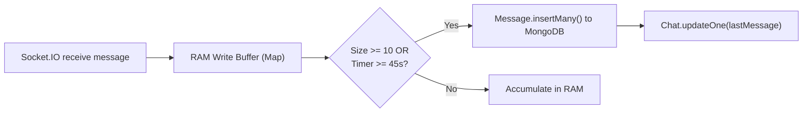

# Whisper — Offline-First, End-to-End Encrypted Real-Time Chat

<p align="center">
  
</p>

<p align="center">
  <strong>A modern, zero-knowledge, offline-first real-time messaging application built with React Native (Expo) and Node.js.</strong>
</p>

<p align="center">
  
  
  
  
  
  
  
  
</p>

---

## 📖 Table of Contents

- [Core Highlights](#-core-highlights)
- [Architecture & Data Flow](#-architecture--data-flow)
- [End-to-End Encryption (E2EE) Deep Dive](#-end-to-end-encryption-e2ee-deep-dive)
- [Offline-First Architecture & Sync Engine](#-offline-first-architecture--sync-engine)
- [High-Performance Backend & Write Buffering](#-high-performance-backend--write-buffering)
- [Features](#-features)
- [Tech Stack](#-tech-stack)
- [Project Structure](#-project-structure)
- [Getting Started](#-getting-started)
  - [Prerequisites](#prerequisites)
  - [Backend Setup](#backend-setup)
  - [Mobile App Setup](#mobile-app-setup)
- [API & Socket Reference](#-api--socket-reference)
- [Security & Privacy Design](#-security--privacy-design)

---

## 🌟 Core Highlights

1. **Zero-Knowledge End-to-End Encryption (E2EE)**: Messages are encrypted directly on the client using **TweetNaCl** (Curve25519, XSalsa20-Poly1305). Neither the server nor any intermediate relay can read the plaintext.
2. **True Offline-First Design**: Powered by a local **Expo SQLite** database configured with Write-Ahead Logging (WAL mode) and an asynchronous sequential synchronization engine. You can read, compose, and delete messages completely offline.
3. **Optimistic UI with Automatic Sync**: Instantaneous local rendering with UUID generation; queued messages transition seamlessly from `pending` &rarr; `sending` &rarr; `sent` &rarr; `delivered` upon network reconnection.
4. **Delta Pull Synchronization**: When reconnecting or launching the app, a delta sync query retrieves any messages missed during offline periods or app hibernation.
5. **High-Throughput Write-Buffered Backend**: High-frequency real-time messaging is buffered in-memory on Express/Node and batch-flushed to MongoDB periodically or upon queue saturation, dramatically reducing database I/O.
6. **Rich Media Pipeline**: Seamless file, photo, video, and audio messaging with Cloudinary storage, native `XMLHttpRequest` upload progress tracking, local filesystem caching (`expo-file-system`), and in-app playback (`expo-video`).

---

## 🏗 Architecture & Data Flow

```mermaid
flowchart TD
    subgraph Client ["Client Device (React Native / Expo)"]
        UI["User Interface (Chat Screen)"]
        Crypto["TweetNaCl Engine (X25519 + XSalsa20)"]
        SQLite[("Local SQLite (chat.db - WAL Mode)")]
        SyncQueue["Sequential Sync Engine (FIFO)"]
        NetDetector["NetInfo Network Detector"]
        FileCache["Local File Cache (expo-file-system)"]
    end

    subgraph Backend ["Server & Cloud Infrastructure"]
        SocketServer["Socket.IO Gateway (Clerk JWT Auth)"]
        RAMBuffer["In-Memory Write Buffer (Map + Timers)"]
        MongoDB[("MongoDB Replica Set")]
        Cloudinary["Cloudinary CDN / Storage"]
        Clerk["Clerk Authentication Service"]
    end

    %% Outgoing flow
    UI -->|1. Raw text| Crypto
    Crypto -->|2. Dual Ciphertexts + Nonce| SQLite
    SQLite -->|3. Optimistic render| UI
    SQLite -->|4. Pick oldest pending| SyncQueue
    NetDetector -.->|Network status| SyncQueue
    SyncQueue -->|5. emit('send-message')| SocketServer

    %% Backend processing
    SocketServer -->|6. Auth handshake| Clerk
    SocketServer -->|7. Append message| RAMBuffer
    RAMBuffer -->|8. Batch insert / Flush| MongoDB
    SocketServer -->|9. emit('message_ack')| SyncQueue
    SyncQueue -->|10. Update status to 'sent'| SQLite

    %% Incoming flow & Delivery
    SocketServer -->|11. Real-time push| RecipientSocket["Recipient Device"]
    
    %% Media Flow
    UI -->|Media Upload| Cloudinary
    Cloudinary -->|Media URL + Metadata| UI
    Cloudinary -.->|Download on-demand| FileCache
```

---

## 🔐 End-to-End Encryption (E2EE) Deep Dive

Whisper implements a zero-knowledge cryptographic model where private keys never leave the user's custody.

### 1. Cryptographic Primitives
- **Key Exchange**: X25519 (Elliptic Curve Diffie-Hellman over Curve25519).
- **Symmetric Encryption**: XSalsa20 stream cipher with 256-bit keys.
- **Authentication**: Poly1305 MAC (128-bit authentication tag).
- **Implementation**: Implemented via `tweetnacl` (`nacl.box`) and `tweetnacl-util`.
- **Entropy & PRNG**: TweetNaCl’s PRNG is explicitly patched with `expo-crypto`'s `getRandomBytes()` to guarantee hardware-backed cryptographic randomness on mobile runtimes.

### 2. Dual-Box Encryption Pattern
A common problem in E2E messaging is allowing users to read their own sent messages on another device or after a database re-sync. Whisper solves this with **Dual-Box Encryption**:

```typescript
// nacl.box(plaintext, nonce, recipientPublicKey, senderSecretKey)
const encryptedForRecipient = nacl.box(
  messageBytes,
  recipientNonce,
  recipientPublicKey,
  senderSecretKey
);

// nacl.box(plaintext, nonce, senderPublicKey, senderSecretKey)
const encryptedForSender = nacl.box(
  messageBytes,
  senderNonce,
  decodeBase64(senderPublicKey),
  senderSecretKey
);
```

- Each message generates **two unique 24-byte nonces**.
- One payload is encrypted for the recipient; the second payload is encrypted for the sender's own public key.
- When retrieving messages, `selectEncryptedPayloadForUser()` automatically chooses the correct ciphertext and nonce based on whether the authenticated user was the sender or recipient.

### 3. Key Lifecycle & Recovery
- **Generation**: Created automatically on first login.
- **Local Storage**: Persisted locally in encrypted application storage (`AsyncStorage`).
- **Encrypted Remote Backup**: Users can optionally backup their keypair to the authenticated `/api/users/key-pair` endpoint (secured via Clerk session tokens), enabling seamless multi-device continuity and account restore on reinstall.

---

## ⚡ Offline-First Architecture & Sync Engine

Whisper treats the network as an enhancement rather than a prerequisite. The local database is the single source of truth for the UI.

### 1. Local Database Schema (`expo-sqlite`)
The database runs in Write-Ahead Logging mode (`PRAGMA journal_mode = WAL`) and serializes queries through a Promise queue (`runWithDb`) to prevent Android/iOS native thread contention.

- **`messages`**: Stores both local UUID (`id`) and MongoDB server ID (`server_id`), `chat_id`, ciphertexts, nonces, public keys, status, file metadata, deletion markers (`deleted_for`, `is_deleted`), and retry counts.
- **`chats`**: Local cache of conversations, participant info, unread counters, and last message snippets.
- **`friends`**: Local cache of friend records and public keys for offline composition.
- **`pending_actions`**: Queue of offline user actions (e.g. `delete_for_me`, `delete_for_everyone`) waiting to sync with the server.

### 2. The Push Synchronization Engine (`syncEngine.ts`)
1. **FIFO Sequential Processor**: Reads the oldest pending or interrupted sending message (`status IN ('pending', 'sending')`).
2. **Status Transition**: Upgrades the message status to `'sending'` locally.
3. **Socket Dispatch with Timeout**: Emits `send-message` with a 5-second ACK timeout.
4. **Idempotent Acknowledgment**:
   - Server returns `message_ack` with `serverId` (MongoDB `_id`).
   - SQLite updates the message status to `'sent'` and persists `server_id`.
   - TanStack React Query cache is automatically invalidated.
5. **Fail-Safe & Exponential Retry**:
   - Timeouts or transient network errors bump `retry_count`.
   - Messages exceeding 5 failed attempts transition to `'failed'` and yield to subsequent queue items.
6. **Network Reconnection Healing**:
   - When `@react-native-community/netinfo` signals network reconnection, `resetSendingToPending()` resets any stalled `'sending'` messages back to `'pending'` and resumes the loop.

### 3. Delta Pull Synchronization (`/api/messages/sync`)
- When the socket connects or app boots, the client sends `lastSyncTimestamp`.
- The server responds with all messages across the user's active chats where `createdAt > after` or `updatedAt > after`.
- Missed messages are inserted directly into SQLite with status `'delivered'`, triggering instant UI updates.

---

## 🚀 High-Performance Backend & Write Buffering

To prevent MongoDB write bottlenecks during peak messaging traffic, Whisper utilizes an **in-memory write buffer**:



- **Batch Insertion**: Incoming messages are placed into a chat-specific memory queue (`messageBuffer`).
- **Dual Flush Triggers**:
  - **Size-based**: Flushes immediately when queue reaches `MAX_BUFFER_SIZE = 10`.
  - **Time-based**: Flushes automatically when `FLUSH_INTERVAL_MS = 45000` (45s) elapses.
- **Zero Data Inconsistency**: The read endpoints (`/api/messages/:chatId` and `/api/messages/sync`) dynamically combine persisted MongoDB records with active in-memory buffer messages.
- **Graceful Shutdown**: Intercepts `SIGINT` and `SIGTERM` signals to flush all buffers before exiting.

---

## ✨ Features

- [x] **Real-Time 1-on-1 Messaging**: Sub-millisecond message delivery via WebSockets.
- [x] **End-to-End Encryption**: Curve25519 / XSalsa20 / Poly1305 authenticated encryption.
- [x] **Offline-First Chat**: Read, write, and search messages without an internet connection.
- [x] **Message Delivery States**: Real-time visual status badges:
  - 🕒 `pending`: Queued locally in SQLite.
  - 🔄 `sending`: Actively transmitting to server.
  - ✓ `sent`: Acknowledged by server.
  - ⚠️ `failed`: Message failed after max retries; tap to retry.
- [x] **Media & File Attachments**:
  - Send photos, videos, audio, and documents (up to 10MB).
  - Background upload progress tracking (0%–100%).
  - Local caching with `expo-file-system` to avoid redundant downloads.
  - Full-screen media viewer and built-in video player via `expo-video`.
  - Native file sharing via `expo-sharing`.
- [x] **Typing Indicators & Presence**:
  - Real-time online/offline indicator tracking multi-socket connections.
  - Debounced typing indicators.
- [x] **Message Deletion**:
  - **Delete for me**: Hides messages locally and records in backend.
  - **Delete for everyone**: Soft-deletes message for all chat participants.
  - Offline deletion actions queued and replayed upon reconnection.
- [x] **Friend & Contact Management**:
  - Real-time user search by unique username.
  - Send, accept, and reject friend requests with live socket notifications.
- [x] **Profile & Account Management**:
  - Custom usernames with uniqueness validation.
  - Account deletion cascade (erases messages, chats, requests, MongoDB records, Clerk user, and local SQLite data).
  - Dark / Light / System theme switching powered by NativeWind.

---

## 🛠 Tech Stack

### Mobile Client
| Category | Technology |
|---|---|
| **Framework** | React Native 0.86, Expo SDK 57 (New Architecture enabled) |
| **Routing** | Expo Router v4 (File-based routing) |
| **Styling** | NativeWind v4, Tailwind CSS 3.4 |
| **Local Database** | `expo-sqlite` (WAL mode, serialized query queue) |
| **State & Server Cache** | Zustand, TanStack React Query v5 |
| **Cryptography** | `tweetnacl`, `tweetnacl-util`, `expo-crypto` |
| **Media & Hardware** | `expo-file-system`, `expo-video`, `expo-document-picker`, `expo-sharing` |
| **Authentication** | `@clerk/expo` |
| **Networking** | `socket.io-client`, `axios`, `@react-native-community/netinfo` |

### Backend Server
| Category | Technology |
|---|---|
| **Runtime & Framework** | Node.js, Express 5 |
| **Real-Time** | Socket.IO 4.8 (WebSockets + Polling fallback) |
| **Primary Database** | MongoDB with Mongoose 9 |
| **Authentication** | `@clerk/express` (JWT session verification & provisioning) |
| **Media Storage** | Cloudinary, Multer |
| **In-Memory Optimization** | Native Node.js write buffer Map with batch inserts |

---

## 📁 Project Structure

```text
chat-app/
├── backend/
│   ├── src/
│   │   ├── config/              # MongoDB connection & Cloudinary setup
│   │   ├── controllers/         # Auth, chat, friend, message, upload, user controllers
│   │   ├── middleware/          # Clerk auth guard, error handler, multer upload
│   │   ├── models/              # Mongoose schemas (User, Chat, Message, FriendRequest)
│   │   ├── routes/              # Express REST routes
│   │   ├── services/            # Cloudinary upload service
│   │   └── utils/
│   │       ├── messageBuffer.js # In-memory write buffer & batching system
│   │       ├── socket.js        # Socket.IO connection & event handlers
│   │       └── username.js      # Username generation & validation
│   ├── index.js                 # Server entrypoint with graceful shutdown
│   └── package.json
│
├── mobile-app/
│   ├── app/                     # Expo Router file-based screens
│   │   ├── (auth)/              # Sign-in & sign-up screens
│   │   ├── (tabs)/              # Main tabs (Chats, Friends, Profile)
│   │   ├── chat/[id].tsx        # 1-on-1 Conversation screen
│   │   └── _layout.tsx          # Root provider & sync initialization
│   ├── components/              # ChatItem, MessageBubble, FileMessageBubble, etc.
│   ├── crypto/
│   │   ├── keyManager.ts        # TweetNaCl key generation & backup
│   │   └── messageCrypto.ts     # X25519 & XSalsa20-Poly1305 encryption/decryption
│   ├── db/
│   │   ├── database.ts          # Expo SQLite initialization (WAL mode & serial queue)
│   │   ├── messageQueries.ts    # Message insert, status updates, pending actions
│   │   ├── chatQueries.ts       # Conversation cache queries
│   │   └── friendQueries.ts     # Local friend directory queries
│   ├── hooks/                   # Custom hooks (useMessages, useChats, useNetworkSync, etc.)
│   ├── lib/
│   │   ├── socket.ts            # Socket.IO Zustand store & real-time handlers
│   │   ├── syncEngine.ts        # Offline sequential FIFO sync engine
│   │   ├── fileCache.ts         # Expo FileSystem media downloader & cache
│   │   ├── uploadService.ts     # XHR upload service with progress callback
│   │   └── theme.ts             # Dark/light theme management
│   └── package.json
└── README.md
```

---

## 🚀 Getting Started

### Prerequisites
- **Node.js**: v18.0 or higher
- **MongoDB**: Local instance or MongoDB Atlas cluster URI
- **Clerk Account**: For user authentication
- **Cloudinary Account**: For file and media attachment storage
- **Expo Go / Development Build**: Android Studio (Emulator) or physical device

---

### Backend Setup

1. **Navigate to the backend directory**:
   ```bash
   cd backend
   npm install
   ```

2. **Configure environment variables**:
   Create a `.env` file in the `backend/` directory:
   ```env
   PORT=3000
   MONGO_URI=mongodb+srv://<username>:<password>@cluster.mongodb.net/whisper?retryWrites=true&w=majority
   CLERK_PUBLISHABLE_KEY=pk_test_...
   CLERK_SECRET_KEY=sk_test_...
   CLOUDINARY_CLOUD_NAME=your_cloud_name
   CLOUDINARY_API_KEY=your_api_key
   CLOUDINARY_API_SECRET=your_api_secret
   ```

3. **Start the backend development server**:
   ```bash
   npm run dev
   ```
   The backend will start at `http://localhost:3000` with WebSocket support enabled.

---

### Mobile App Setup

1. **Navigate to the mobile app directory**:
   ```bash
   cd mobile-app
   npm install
   ```

2. **Configure environment variables**:
   Create a `.env` file in the `mobile-app/` directory:
   ```env
   EXPO_PUBLIC_CLERK_PUBLISHABLE_KEY=pk_test_...
   EXPO_PUBLIC_API_URL=http://<YOUR_LOCAL_IP>:3000/api
   EXPO_PUBLIC_SOCKET_URL=http://<YOUR_LOCAL_IP>:3000
   ```
   *(Replace `<YOUR_LOCAL_IP>` with your computer's local network IP address, e.g. `192.168.1.15`)*

3. **Start the Expo development server**:
   ```bash
   npm run start
   ```

4. **Run on Android / iOS**:
   - Press `a` in the terminal to run on an Android emulator or connected device.
   - Or scan the QR code via the **Expo Go** app on your phone.

---

## 📡 API & Socket Reference

### REST Endpoints
| Method | Route | Description | Auth Required |
|---|---|---|---|
| `GET` | `/health` | Server health check (supports `GET` & `HEAD`) | No |
| `GET` | `/api/chats` | Get all conversations with latest message | Yes |
| `POST`| `/api/chats/with/:participantId` | Get or initialize conversation | Yes |
| `GET` | `/api/messages/:chatId` | Get messages for chat (MongoDB + RAM buffer) | Yes |
| `GET` | `/api/messages/sync?after=` | Delta synchronization of missed messages | Yes |
| `POST`| `/api/upload` | Multipart file upload (images, video, docs) | Yes |
| `GET` | `/api/users/search?username=` | Search users and query friendship status | Yes |
| `GET` | `/api/users/key-pair` | Retrieve authenticated user's key backup | Yes |
| `POST`| `/api/users/key-pair` | Backup public & private keys | Yes |
| `GET` | `/api/users/:userId/public-key` | Retrieve public key of recipient | Yes |
| `DELETE`| `/api/users/account` | Cascade delete user account and all data | Yes |

### Socket.IO Events
| Event Direction | Event Name | Payload / Description |
|---|---|---|
| **Client &rarr; Server** | `send-message` | `{ localId, chatId, ciphertext, nonce, senderCiphertext, senderNonce, senderPublicKey, filePayload }` |
| **Server &rarr; Client** | `message_ack` | `{ localId, serverId }` (confirms receipt & assigns Mongo ID) |
| **Server &rarr; Client** | `receive_message`| Delivers encrypted payload or file metadata to recipient |
| **Client &rarr; Server** | `typing` | `{ chatId, isTyping }` |
| **Server &rarr; Client** | `typing` | Broadcasts typing state to conversation participants |
| **Client &rarr; Server** | `mark_read` | `{ chatId }` |
| **Server &rarr; Client** | `messages_read` | `{ chatId, readerId }` |
| **Client &rarr; Server** | `delete_for_me` | `{ messageIds, chatId, userId }` |
| **Client &rarr; Server** | `delete_for_everyone` | `{ messageIds, chatId, userId }` |
| **Server &rarr; Client** | `user-online` / `user-offline` | Presence notifications with `userId` |

---

## 🛡 Security & Privacy Design

- **Server Ignorance**: The backend never stores plaintext text messages. The fields stored are base64-encoded `ciphertext`, random `nonce`, and public keys.
- **Ephemeral In-Memory Buffers**: Messages residing temporarily in server RAM remain encrypted at all times.
- **Hardware-Backed Randomness**: Nonces and keypairs are generated using device entropy via `expo-crypto`.
- **Right to be Forgotten (GDPR)**: Account deletion triggers a complete cascade wipe:
  1. Deletes all messages sent by the user.
  2. Pulls user ID from all `readBy` and `deletedFor` sets.
  3. Removes user from all chats (deleting now-empty chats).
  4. Deletes friend requests and User documents in MongoDB.
  5. Deletes user account in Clerk.
  6. Wipes all local SQLite tables (`messages`, `chats`, `pending_actions`) and `AsyncStorage` on device.

---

<p align="center">
  Built with ❤️ for privacy, resilience, and speed.
</p>
